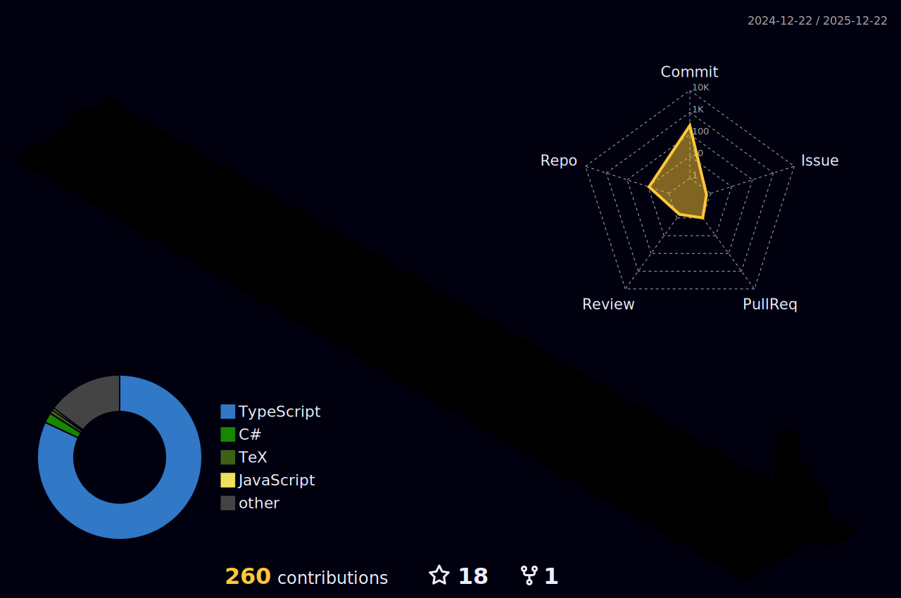

  

<!-- Trophy -->
<!-- <h3 align="left" style="font-family:'Signifier';color:#F2D0A7;font-weight:300;margin:1.5em 0 0.8em;font-style:italic">Trophy & Achievements</h3>

  

 -->

  
🏆 Competitions & Awards

  <ul style="font-family:'Söhne';list-style-type:none;padding-left:0">
    <li>🥇 First Prize in National College English Competition (Category C) Campus Selection 2023</li>
    <li>🥉 Third Prize in the 3rd China University Big Data Challenge 2023</li>
    <li>🏆 Special Prize in the 9th Central and Western China Foreign Language Translation Competition Finals 2023</li>
    <li>🥇 First Prize in Huawei ICT Competition 2023-2024 Campus Selection</li>
    <li>🥉 Third Prize in Huawei ICT Competition 2023-2024 Jiangsu Province</li>
    <li>🥈 Second Prize in the 14th Charoen Pokphand Cup National College Market Research Competition (Jiangsu Province)</li>
    <li>🏆 First Prize & Innovation Award in the 9th Dimension Cup Mathematical Modeling Challenge 2024</li>
    <li>🥈 Second Prize in the 7th "FLTRP Cup" Cross-cultural Competence Competition (Campus Selection)</li>
    <li>🥇 First Prize in College Mathematical Modeling Competition Campus Selection 2024</li>
    <li>🥈 Second Prize in Higher Education Press Cup National Mathematical Modeling Competition (Jiangsu Division) 2024</li>
    <li>🥉 Third Prize in the 7th China University Intelligent Robot Innovation Competition 2024</li>
    <li>🥈 Second Prize in Jiangsu Province College Student Electronic Design Competition (TI Cup) 2024</li>
    <li>🥈 Second Prize in Global Campus AI Algorithm Elite Competition (Jiangsu Division) 2024</li>
    <li>🥉 Third Prize in Global Campus AI Algorithm Elite Competition National Finals 2024</li>
  </ul>

<!-- Top Anchor -->

<!-- Static Header with Logo (Reliable) -->
 

 

<h1 style="border-bottom: none;">Tseka Luk</h1>

<!-- Dynamic Bio (Typing) -->

 

<!-- Social Badges (Minimalist) -->

  
  
  

---

### 🚀 **Nebutra Intelligence**

> **"Nebula · Nurture · Ultra · Future"**  
> *Bridging the gap between AI capabilities and real-world business value.*

As **Founder & CEO**, I operate **Nebutra Intelligence** as an **AI-Native OPC (One-Person Company)**. Leveraging a "Founder + Digital Agents" architecture, I deliver the output of a 7-person agile team.

| **Stage** | **Runway** | **Team Structure** | **Revenue** |
| :---: | :---: | :---: | :---: |
|  |  |  |  |

---

### ⚡ **Selected Works & Open Source**

*   **[any2md](https://github.com/TsekaLuk/any2md)** (Python) - Multi-format document to Markdown converter (PDF/PPT/PNG) keeping tables/formulas.
*   **[Cursor-export-extension](https://github.com/TsekaLuk/Cursor-export-extension)** (TypeScript) - Chrome extension to export Cursor IDE sessions to structured Markdown.
*   **[CDTMP-Agent-Instructions](https://github.com/TsekaLuk/CDTMP-Agent-Instructions)** - Complex Task Agent context persistence instruction set.
*   **[hydrogem-web](https://github.com/TsekaLuk/hydrogem-web)** (React/TS) - Real-time water quality monitoring system with 5s refresh & alerts.

---

### 🛠 **Expertise & Tech Stack**

*"Value-Oriented Engineering" — I don't just write code; I build systems that solve problems.*

#### **AI Theory & Engineering**
| Domain | Skills & Concepts |
| :--- | :--- |
| **Theory** | Statistical Learning, Optimization, Information Theory, Graph Theory, Neural Networks (CNN/RNN/LSTM), Transformers, Attention Mechanism, LLMs, Diffusion Models, GAN/VAE, Knowledge Graphs |
| **Engineering** | PyTorch, TensorFlow, PaddlePaddle, HuggingFace, LangChain, Ollama, OpenAI/Claude/Gemini APIs, Prompt Engineering (CoT/ToT), Context Engineering, Knowledge Distillation |
| **GenAI** | Midjourney, Stable Diffusion, ComfyUI, ControlNet, LoRA, Flux, Black Forest Labs, ElevenLabs (TTS), Runway, Pika |

#### **Development & Architectures**
| Domain | Stack |
| :--- | :--- |
| **Languages** |          |
| **Web** |       |
| **Infra** |     |
| **Web3** | Solidity, Ethereum, Smart Contracts, DAO Governance, Tokenomics |

#### **Product, Data & Tools**
| Domain | Skills |
| :--- | :--- |
| **Product** | PRD Writing, User Personas, SWOT Analysis, UI/UX Prototyping (Figma/Framer/V0), SaaS Architecture |
| **Data** | Pandas, NumPy, SciPy, Matplotlib, SPSS, OriginLab, Gurobi, Mathematica |
| **Tools** | Cursor (Expert), VSCode, JetBrains, Obsidian, Notion, Docker, LaTeX |

---

### 🏆 **Achievements & Honors**

<strong>🏅 Selected Highlights (2024-2025)</strong>

| Year | Level | Award |
| :--- | :--- | :--- |
| **2025** | 🌍 Global | **MCM/ICM Honorable Mention** (Math Modeling) |
| **2025** | 🇨🇳 National | **1st Prize** Brand Planning Competition |
| **2024** | 🇨🇳 National | **1st Prize** APMCM (Asia-Pacific Modeling) |
| **2024** | 🇨🇳 National | **Patent Holder**: Communication Cable Equipment |
| **2024** | 🇨🇳 National | **3x Software Copyrights** (Algorithms/Systems) |

<strong>📜 Full Awards List</strong>

*   **National Level**:
    *   MCM/ICM Honorable Mention (2025)
    *   1st Prize, APMCM (2024)
    *   1st Prize, National Commercial Elite Challenge - Brand Planning (2025)
    *   1st Prize & Special Innovation Award, "Shuwei Cup" Math Modeling (2024)
    *   3rd Prize, Global Campus AI Algorithm Elite Competition Finals (2024)
    *   3rd Prize, China University Intelligent Robot Creative Competition (2024)
    *   Excellent Award, "Blue Bridge Cup" C/C++ Finals (2025)
*   **Provincial Level**:
    *   1st Prize, Market Research and Analysis Competition (Jiangsu) (2025)
    *   1st Prize, "Blue Bridge Cup" C/C++ (Jiangsu) (2025)
    *   2nd Prize, CUMCM (Jiangsu) (2024)
    *   2nd Prize, TI Cup Electronics Design (2024)
    *   2nd Prize, Global Campus AI Algorithm Elite Competition (Jiangsu) (2024)
    *   3rd Prize, Huawei ICT Competition (Network Track) (2024)

---

### 📊 **Engineering Analytics**

<!-- Snake -->
<picture>
  <source media="(prefers-color-scheme: dark)" srcset="https://raw.githubusercontent.com/TsekaLuk/TsekaLuk/output/github-contribution-grid-snake-dark.svg">
  <source media="(prefers-color-scheme: light)" srcset="https://raw.githubusercontent.com/TsekaLuk/TsekaLuk/output/github-contribution-grid-snake.svg">
  
</picture>

<!-- Metrics -->

 

<!-- 3D Graph (Signature) -->

 

  

 

  
  

