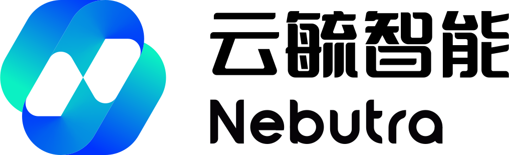

<!-- Trophy -->
<!-- <h3 align="left" style="font-family:'Signifier';color:#F2D0A7;font-weight:300;margin:1.5em 0 0.8em;font-style:italic">Trophy & Achievements</h3>

  

 -->

<!-- Top Anchor -->

<!-- Static Header with Logo (Reliable) -->
 

 

<!-- Dynamic Bio (Typing) -->

 

  
  

<!-- Social Badges (Minimalist) -->

  
  
  

---

### 🚀 **Nebutra Intelligence**

> **"Nebula · Nurture · Ultra · Future"**  
> *Bridging the gap between AI capabilities and real-world business value.*

As **Founder & CEO**, I operate **Nebutra Intelligence** as an **AI-Native OPC (One-Person Company)**. Leveraging a "Founder + Digital Agents" architecture.

| **Stage** | **Runway** | **Team Structure** | **Revenue** |
| :---: | :---: | :---: | :---: |
|  |  |  |  |

---

### 🛠 **Expertise & Tech Stack**

*"Value-Oriented Engineering" — I don't just write code; I design systems that solve problems.*

**AI Engineering & Generative Models**
 

<!-- Restored Concept Skills -->
 

**Next-Gen Tools & AI Coding**
 

**Product, Design & Analytics**
 

<!-- Restored Product/Data Concepts -->
 

**Full Stack Engineering**
 

<!-- Restored Web3 -->
 

---

### 🏆 **Achievements & Honors**

<strong>🏅 Selected Highlights (2024-2025)</strong>

| Year | Level | Award |
| :--- | :--- | :--- |
| **2025** | 🌍 Global | **MCM/ICM Honorable Mention** (Math Modeling) |
| **2025** | 🇨🇳 National | **1st Prize** Brand Planning Competition |
| **2024** | 🇨🇳 National | **1st Prize** APMCM (Asia-Pacific Modeling) |
| **2024** | 🇨🇳 National | **Patent Holder**: Communication Cable Equipment |
| **2024** | 🇨🇳 National | **3x Software Copyrights** (Algorithms/Systems) |

<strong>📜 Full Awards List</strong>

*   **National Level**:
    *   MCM/ICM Honorable Mention (2025)
    *   1st Prize, APMCM (2024)
    *   1st Prize, National Commercial Elite Challenge - Brand Planning (2025)
    *   1st Prize & Special Innovation Award, "Shuwei Cup" Math Modeling (2024)
    *   3rd Prize, Global Campus AI Algorithm Elite Competition Finals (2024)
    *   3rd Prize, China University Intelligent Robot Creative Competition (2024)
    *   Excellent Award, "Blue Bridge Cup" C/C++ Finals (2025)
*   **Provincial Level**:
    *   1st Prize, Market Research and Analysis Competition (Jiangsu) (2025)
    *   1st Prize, "Blue Bridge Cup" C/C++ (Jiangsu) (2025)
    *   2nd Prize, CUMCM (Jiangsu) (2024)
    *   2nd Prize, TI Cup Electronics Design (2024)
    *   2nd Prize, Global Campus AI Algorithm Elite Competition (Jiangsu) (2024)
    *   3rd Prize, Huawei ICT Competition (Network Track) (2024)

---

### 🕒 **Recent Activity**

<!--RECENT_ACTIVITY:last_update-->
Last Updated: Saturday, February 14th, 2026, 8:36:28 PM
<!--RECENT_ACTIVITY:last_update_end-->

<!--RECENT_ACTIVITY:start-->
- ⬆️ Pushed updates to [Nebutra/OpenClaw-Async-Telegram-Bot-Skill](https://github.com/Nebutra/OpenClaw-Async-Telegram-Bot-Skill) 
- ⬆️ Pushed updates to [Nebutra/OpenClaw-Async-Telegram-Bot-Skill](https://github.com/Nebutra/OpenClaw-Async-Telegram-Bot-Skill) 
- ⬆️ Pushed updates to [Nebutra/OpenClaw-Async-Telegram-Bot-Skill](https://github.com/Nebutra/OpenClaw-Async-Telegram-Bot-Skill) 
- ⬆️ Pushed updates to [TsekaLuk/Kaoyan-English1-Papers](https://github.com/TsekaLuk/Kaoyan-English1-Papers) 
- ⬆️ Pushed updates to [Nebutra/OpenClaw-Async-Telegram-Bot-Skill](https://github.com/Nebutra/OpenClaw-Async-Telegram-Bot-Skill) 
- ⬆️ Pushed updates to [TsekaLuk/Kaoyan-Math2-Papers](https://github.com/TsekaLuk/Kaoyan-Math2-Papers) 
<!--RECENT_ACTIVITY:end-->

---

### 📊 **Engineering Analytics**

<!-- Snake -->
<picture>
  <source media="(prefers-color-scheme: dark)" srcset="https://raw.githubusercontent.com/TsekaLuk/TsekaLuk/output/github-contribution-grid-snake-dark.svg">
  <source media="(prefers-color-scheme: light)" srcset="https://raw.githubusercontent.com/TsekaLuk/TsekaLuk/output/github-contribution-grid-snake.svg">
  
</picture>

<!-- Metrics -->

 

  

 

  
  

